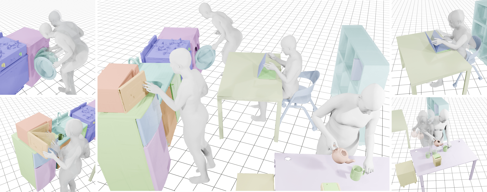

# :house_with_garden: SNU ParaHome  
> ParaHome: Parameterizing Everyday Home Activities Towards 3D Generative Modeling of Human-Object Interactions (arXiv 2024)  
> [Jeonghwan Kim*](https://canoneod.github.io/), [Jisoo Kim*](https://jlogkim.github.io/), [Jeonghyeon Na](https://nagooon.github.io/), [Hanbyul Joo](https://jhugestar.github.io/)  
\[[Project Page](https://jlogkim.github.io/parahome/)\] \[[Paper](https://arxiv.org/pdf/2401.10232.pdf)\] \[[Supp. Video](https://www.youtube.com/embed/HeXqiK0eGec?si=mtAmctx0JHHYD6Ac)\]

<p align="center">    
    
</p>
This is a repository of the ParaHome system. Our system is designed to capture human-object interaction in a natural home environment. We parameterized all 3D movements of body, hands, and objects and captured large-scale dataset for human-object interaction.


## News
- 2024.08.29: 🎉 ParaHome dataset has been released! 🎉
- 2024.05.01: ParaHome demo data is available!

## Summary
- Total <b>486</b> minutes, <b>207</b> sequences from <b>38</b> subjects!
- Scanned, parameterized <b>22</b> Objects
- Human Objects Interaction in a <b>natural room setting.</b>
- Dexterous hand manipulation and body motion data.
- Interaction with <b>multiple articulated</b> objects.
- Capture <b>natural sequential</b> manipulation scenes.
- <b>Text annotations</b> for each action

  

  


## Important Notes
- The text descriptions for each action are formatted into the `text_annotation.json` file located within each scene directory.
- Items retrieved from the under-sink cabinet are filled manually due to the absence of cameras inside the cabinet. Thus, some of data may not accurately be physically aligned with its actual location, and some penetration errors may occur.


## Download ParaHome Data
```
mkdir data
```  
scan : https://drive.google.com/file/d/1-OuWvVFOFCEhut7J2t1kNbr5jv78QNFP/view?usp=sharing  
seq : https://drive.google.com/file/d/10MYSSM2H7f6g2n9nnXta48qmAhZ7r4yd/view?usp=sharing  
demo : https://drive.google.com/file/d/1hx3p3uOLEmGoCsaZ_x5ibffuX4zLiq6s/view?usp=sharing  
metadata : https://drive.google.com/file/d/1jPRCsotiep0nElHgyLQNjlkHsWgHbjhi/view?usp=sharing  
joint_info : https://drive.google.com/file/d/15fGnZn8o4I2bzQtQF-9MliwxKc2IUdzI/view?usp=sharing  

Unzip and move scan, seq directories into `data` directory
```
.
├── assets
├── visualize
├── data
│   ├── scan
└── └── seq
│       ├── s1 ~ s207
│       └── ├── text_annotations.json
│       └── ├── object_transformations.pkl
│       └── ├── object_in_scene.json
│       └── ├── joint_states.pkl
│       └── ├── joint_positions.pkl
│       └── ├── head_tips.pkl
│       └── ├── hand_joint_orientations.pkl
│       └── ├── bone_vectors.pkl
│       └── ├── body_joint_orientations.pkl
│       └── └── body_global_transform.pkl
└── ─── metadata.json

```
Each data represents

- text_annotations.json : Action descriptions at each frame interval of sequences
- object_transformations.pkl : per-frame transformations of each object in the scene
- object_in_scene.json : Indicator of whether object is in the scene or not
- joint_states.pkl : Joint state(either radian for revolute part or meter for prismatic part) of each part of the articulated objects
- joint_positions.pkl : Joint global positions of capture participants
- head_tips.pkl : Head tip position of participants (head size is assumed)
- hand_joint_orientations.pkl : Joint orientation of each hand joint in hand-centered coordinate system
- bone_vectors.pkl : T-Pose (with no orientation applied) with each bone length applied
- body_joint_orientations.pkl : Joint orientation of each body joint in body-centered coordinate system
- body_global_transform.pkl : Transform between body-centered coordinate and global coordinate system
- metadata.json : Mapping between capture participants to each sequence

## Environment Setting
Check out [install.md](./install.md)

## Visualize Demo files
To visualize the demo parahome data, select sequence path in the data/seq directory and execute the command 
```
cd visualize
python render.py --scene_root data/seq/s1
```
- Our rendering code supports an egocentric option. Use the egocentric rendering with `--ego` option.


---


### Citation
```
@misc{kim2024parahome,
      title={ParaHome: Parameterizing Everyday Home Activities Towards 3D Generative Modeling of Human-Object Interactions}, 
      author={Jeonghwan Kim and Jisoo Kim and Jeonghyeon Na and Hanbyul Joo},
      year={2024},
      eprint={2401.10232},
      archivePrefix={arXiv},
      primaryClass={cs.CV}
}
```

### License
The ParaHome Dataset is licensed under a [Creative Commons Attribution-NonCommercial-ShareAlike 4.0 International License](https://creativecommons.org/licenses/by-nc-sa/4.0/deed.en) and is intended for non-commercial academic use. By using the dataset and its associated software, you agree to cite the relevant paper in any publications resulting from your use of these resources.


